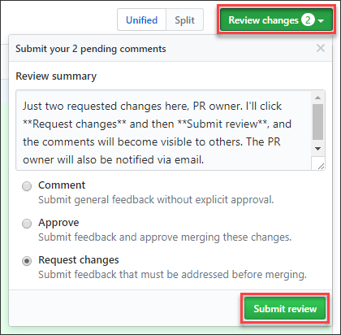

# Review open pull requests in GitHub

This article explains how to contribute to Microsoft Learn by reviewing pull requests (PRs) and adding your comments. You can read new topics and see proposed updates before they're published by checking a public GitHub repository's open PR queue. Community feedback on proposed updates helps the entire community.

With PR comments and reviews, you can:

- Add and reply to comments on the PR.
- React to comments with emojis like 👍, ❤️, and 🎉.

## Prerequisites

- [Create a GitHub account](index.md#create-a-github-account), if you don't have one.

## Find a PR

1. In your browser, navigate to the repository in GitHub that you want to review. If you're not sure which repo to look at, find one that interests you in our [list of Microsoft Learn repos](https://github.com/orgs/MicrosoftDocs/repositories).

    If you're browsing documentation and don't know which repo it belongs to, select the **Edit** pencil icon at the top of the page. This action takes you to the source file on GitHub. The repository name is displayed in the upper-left corner of the page. For example, the following image shows the repo name location for the `azure-dev-docs` repo.

    :::image type="content" source="media/how-to-review-pull-request/find-repo-name.png" alt-text="Screenshot of a GitHub article page showing the repo name in the upper left-hand corner of the page.":::

1. Choose the **Pull requests** tab to see the open PRs for that repo. If the repo has a lot of PRs, use the **Filters** bar to filter by label, author, and more. Or use the **Search** bar to look for specific queries.

    :::image type="content" source="media/how-to-review-pull-request/list-of-prs.png" alt-text="Screenshot of a GitHub repo showing the pull requests tab.":::

1. Open a PR by selecting the title link.

## Review a PR

1. In the PR you're reviewing, select the **Files changed** tab.

    :::image type="content" source="media/how-to-review-pull-request/pr-menu.png" alt-text="Screenshot of tabs on the GitHub pull request page. The tab titled Files Changed is highlighted.":::

1. Compare the original document to the edited one. The original document will be in red, and the proposed document will be in green. Any added text will be highlighted in the green (new) section, and any deleted text will be highlighted in the red (original) section.

    :::image type="content" source="media/how-to-review-pull-request/compare-docs.png" alt-text="Screenshot of a GitHub Files Changed page. An example of original content highlighted in red and edited content highlighted in green is displayed.":::

1. Add comments or suggest changes by selecting the plus (+) icon to the left of the line you'd like to comment on. To select multiple lines, select and drag the plus sign.

    :::image type="content" source="media/how-to-review-pull-request/plus-sign.png" alt-text="Screenshot of a GitHub Files Changed page. The plus sign icon, intended for the user to select to enter in-line comments, is featured.":::

    You can only add comments or suggestions to lines that have been edited in the current PR. To make other changes, [edit that file in your own PR](how-to-write-quick-edits.md).

1. A box will open. Enter your comments or questions there. If you'd like, you can use the buttons in the toolbar to format your text, add bulleted and numbered lists, or insert code blocks and images.

    :::image type="content" source="media/how-to-review-pull-request/comment-box.png" alt-text="Screenshot of a GitHub Files Changed page. The comment box element is featured.":::

1. You can also suggest a change to the text in that line.

    1. In the toolbar for the comment, select the **+-** icon (probably the icon furthest to the left). This is the **Insert a suggestion** button.

        :::image type="content" source="media/how-to-review-pull-request/insert-suggestion.png" alt-text="Screenshot of tabs in a comment box on the GitHub Files Changed page. The tab with a + and - icon is highlighted.":::

    1. The text from the line you selected will be included in a code block (inside two sets of ``` backticks).

        :::image type="content" source="media/how-to-review-pull-request/suggestion-text.png" alt-text="Screenshot of a comment box on the GitHub Files Changed page. An example of how to write the syntax for a suggestion is displayed.":::

        To suggest changes to text that includes a triple-ticked code fence (```), replace the outer/enclosing `suggestion` backticks with tildes (`~~~`).

    1. Edit the text. Use the buttons in the comment box for simple formatting like bold, italics, and bullets, or use the [Markdown syntax elements](/help/contribute/markdown-reference) directly. You can also add comments to this box below the code-block section.

1. After you've made your comment, select **Start a review**. The PR author will be notified of your changes. If you used the **Insert a suggestion** button in the previous step, the author will be able to commit your suggestion directly to the document.

   If you want to bring someone else into the conversation, you can **@mention** other contributors by their GitHub alias in your comments. Mentioned GitHub users will receive an email containing your comment. You can also use Markdown in your comments, and your comment's Markdown is rendered once you submit the comment.

1. In the **Conversations** tab, read through the comments. If you have questions or comments, add them to the conversation. You can also add reactions to comments by selecting the smiley face icon in the bottom-left corner of each comment.

## Submit a review

Once you've added all your comments to the review, submit your review.

1. Select the **Review changes** button in the upper-right of the *Files changed* tab to open the review submittal dialog.
1. Enter a descriptive **Review summary**.
1. Select the radio button for your desired review type, and then choose **Submit review**.

  

The PR author will receive notification of the review.

## Next steps

To learn more about commenting and reviews, check out these articles in GitHub's documentation.

- [Review changes in PRs](https://help.github.com/articles/reviewing-changes-in-pull-requests/)
- [Comment on a PR](https://help.github.com/articles/commenting-on-a-pull-request/)
- [Review proposed changes in a PR](https://help.github.com/articles/reviewing-proposed-changes-in-a-pull-request/)