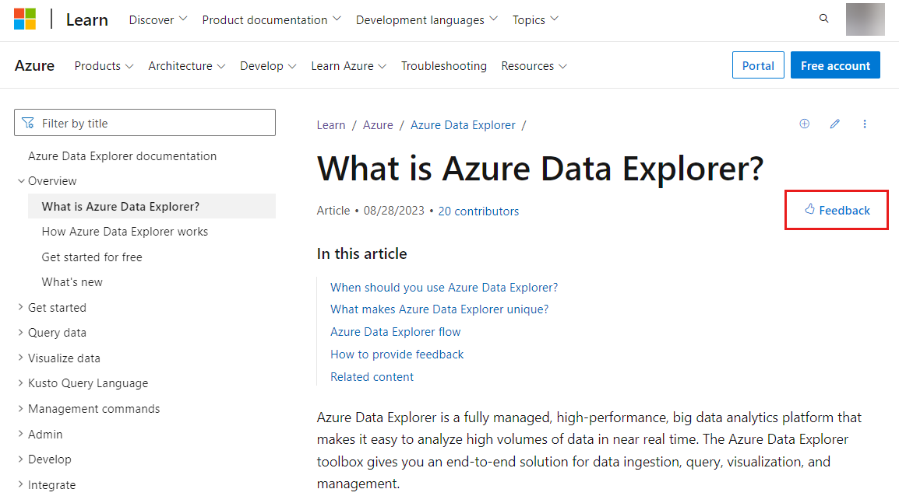
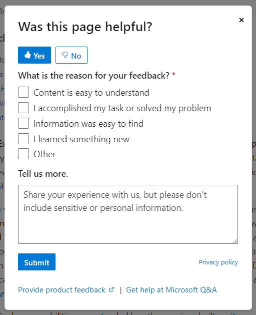

# Provide feedback for Microsoft Learn content

This article explains how to provide feedback for Microsoft Learn content using the new feedback experience. This unified feedback experience is now standard across all documentation or training content on Microsoft Learn. The new system:

- Unifies our systems to efficiently incorporate your feedback, including better routing for customer feedback to our support, product, and content teams.
- Supports global accessibility for non-English learners.
- Allows for anonymous feedback to protect learner privacy.
- Supports the variety of people who use Microsoft Learn, not all of whom use GitHub regularly.

All content on Microsoft Learn uses the new standard experience. Depending on the repository, you may see an open-source experience in addition to the standard feedback experience.

While GitHub issues are no longer supported in repositories using only the standard experience, you can still contribute to Microsoft Learn documentation by [creating a pull request](how-to-write-quick-edits.md) if you spot an error or wish to add something for any repository that already had this capability enabled. Also, you can still view an article's change history and contributors by selecting the **Edit** pencil at the top of the page and then selecting **History**:

:::image type="content" source="media/provide-feedback/history.png" alt-text="Screenshot of the history button in GitHub for the web.":::

## Prerequisites

- None, if using the [standard experience](#use-the-standard-experience).
- A GitHub account, if using the [open-source experience](#use-the-open-source-experience).

## Use the standard experience

The new standard experience allows you to provide feedback using a thumbs up/thumbs down control. You don’t need to log in or create an account to use this experience.

To leave feedback using the standard experience:

1. Navigate to the article you’d like to give feedback on.
1. Find the **Feedback** link and select it.
    1. In documentation that has only the standard experience enabled, the link is at the top of the page and in a larger box at the bottom of the page.

        

    1. In training modules, the link is at the top of the module’s landing page and at the bottom of each unit within the module.

        

1. Choose the thumbs up option if you found the page helpful; choose the thumbs down option if it wasn’t.
1. Choose one or multiple reasons for your feedback. Optionally, we highly encourage you to use the comment box (which supports up to 999 characters of text) to provide specific feedback on the content.

    

    Readers of localized content will see an additional option to provide feedback on the translation quality.

    The feedback control allows you to provide feedback on Microsoft Learn content. Your feedback will be evaluated by Microsoft content writers, not product teams.

    Some content teams may also configure these other links to appear at the bottom of the feedback control:

    - **Provide product feedback**: This link allows you to provide feedback for the product itself rather than the content. Selecting this link will take you to a platform where you can provide feedback on the product, which is reviewed by the respective product teams.
    - **Get help**: Depending on how this link is configured, it takes you to either the product's community site or the Q&A platform. If you have specific questions and require community assistance, you can use these platforms to get help.

1. Select **Submit**.

> [!NOTE]
> The feedback you provide is anonymous, and Microsoft doesn’t collect personal data from your submission. In the new experience, feedback isn’t publicly visible to ensure customer privacy. You won't receive a response after you submit your feedback.

## Use the open-source experience

The open-source feedback experience allows open-source communities to use GitHub issues for documentation related to open-source products. When enabled, this hybrid experience includes the standard feedback experience at the top of the page and an option to open a GitHub issue at the bottom of the page:

:::image type="content" source="media/provide-feedback/open-source.png" alt-text="Screenshot of the open-source experience at the bottom of a documentation page.":::

To open a GitHub issue, you must have a GitHub account. For more information, see [Create GitHub issues](how-to-create-github-issues.md).

Currently, the open-source experience is enabled for the following repositories:

- Azure/azure-docs-sdk-dotnet
- Azure/azure-docs-sdk-java
- dotnet/AspNetCore.Docs
- dotnet/docs
- dotnet/docs-aspire
- dotnet/docs-desktop
- dotnet/docs-maui
- dotnet/entityframework.apidocs
- dotnet/entityframework.docs
- dotnet/maui-api-docs
- MicrosoftDocs/azure-docs-powershell
- MicrosoftDocs/azure-docs-sdk-node
- MicrosoftDocs/azure-docs-sdk-python
- MicrosoftDocs/community-content
- MicrosoftDocs/microsoft-365-community
- MicrosoftDocs/PowerShell-Docs
- MicrosoftDocs/PowerShell-Docs-DSC
- MicrosoftDocs/PowerShell-Docs-Modules
- MicrosoftDocs/PowerShell-Docs-PSGet
- MicrosoftDocs/terminal
- MicrosoftDocs/Windows-Dev-Docs
- MicrosoftDocs/WSL
- Mono/SkiaSharp-API-docs
- OfficeDev/office-js-docs-pr
- OfficeDev/office-js-docs-reference
- OfficeDev/office-scripts-docs
- OfficeDev/office-scripts-docs-reference
- Xamarin/essentials

## Related content

- [Edit documentation in the browser](how-to-write-quick-edits.md)